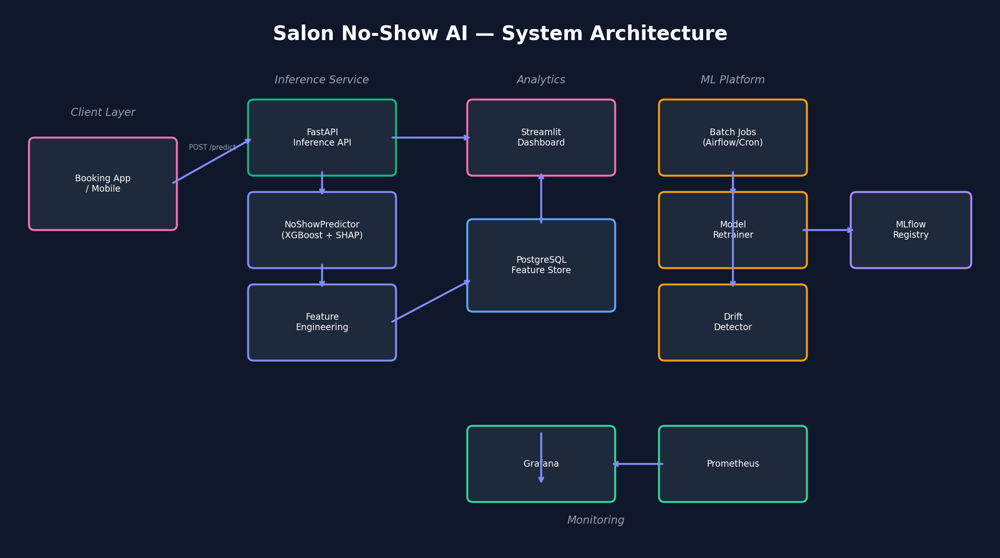

# 💇 AI-Powered No-Show & Customer Intelligence Module
### Enterprise Salon Booking Platform — HAIR RAP BY YOYO

> **Enterprise-grade no-show prediction system** for multi-branch salon operations.  
> Powered by XGBoost + SHAP explainability, with a real-time FastAPI inference layer,  
> customer retention intelligence engine, data drift detection, and an interactive Streamlit dashboard.

---

## 📁 Project Structure

```
salon-noshow-ai/
├── api/
│   ├── main.py               # FastAPI inference server (single + batch endpoints)
│   └── schemas.py            # Pydantic request/response models
├── dashboard/
│   └── app.py                # Streamlit dashboard (5 interactive pages)
├── data/
│   ├── generate_data.py      # Synthetic data generator (50K records, realistic traits)
│   └── bookings.csv          # Generated dataset
├── src/
│   ├── data_pipeline.py      # Feature engineering pipeline (51 features, 9 categories)
│   ├── model_trainer.py      # Model training, comparison, Optuna tuning
│   ├── predictor.py          # NoShowPredictor inference class
│   ├── drift_detector.py     # KS + Chi-square data drift detection
│   └── retention.py          # RFM-based customer segmentation & churn scoring
├── tests/
│   └── test_predictor.py     # Unit + integration tests
├── architecture_diagram.png  # System architecture diagram
├── Dockerfile                # Multi-service container (FastAPI + Streamlit)
└── requirements.txt
```

---

## 🚀 Quick Start

### Option 1 — Docker (Recommended)

```bash
# Build and run both services (FastAPI + Streamlit)
docker build -t salon-noshow-ai .
docker run -p 8000:8000 -p 8501:8501 salon-noshow-ai

# Access
# API:       http://localhost:8000/docs
# Dashboard: http://localhost:8501
```

### Option 2 — Local Setup

```bash
# Install dependencies
pip install -r requirements.txt

# Generate synthetic dataset
python data/generate_data.py

# Train models (runs all 5 models + Optuna tuning + saves best)
python src/model_trainer.py

# Start the inference API
uvicorn api.main:app --host 0.0.0.0 --port 8000

# Start the dashboard (separate terminal)
streamlit run dashboard/app.py --server.port 8501
```

---

## 📊 1. EDA Findings

### Dataset Overview

| Property | Value |
|----------|-------|
| Total booking records | 50,000 |
| Unique customers | 5,000 |
| Branches | 5 (Ahmedabad multi-branch) |
| Service types | 8 |
| Booking window | 12 months (chronological history) |
| Overall no-show rate | ~19% (realistic class imbalance) |
| Customer trait distribution | Beta(2,8) — ~70% reliable, ~15% moderate, ~15% high-risk |

### Top 5 EDA Insights

| # | Insight | Business Impact |
|---|---------|----------------|
| 1 | **Cash payment → ~30%+ no-show rate** vs ~10% for Online Prepaid | Payment commitment is the strongest controllable factor |
| 2 | **New customers (0 visits) → ~27% no-show** vs ~12% for loyal (10+ visits) | Customer reliability trait drives consistent behavior |
| 3 | **Cash + New customer combo → 35%+ no-show** | Interaction effects are stronger than individual factors |
| 4 | **Late evening slots (after 7 PM) → 4–8% higher no-show** than morning slots | End-of-day fatigue compounds with other risk factors |
| 5 | **Bridal → ~5% no-show** vs ~25% for Manicure/Pedicure | High-commitment prepaid services naturally retain customers |

### Key Patterns Discovered

- **Customer personality is the #1 predictor** — Chronic no-showers consistently no-show across visits, regardless of service or time
- **Branch × Service interactions matter** — Chandkheda + Manicure (~27%) vs Memnagar + Bridal (~3%)
- **Monsoon months (Jul–Sep)** show ~4% elevated no-show due to weather/travel friction
- **Monday mornings** have the highest no-show rate of any day-of-week × time slot combination
- **U-shaped lead time curve** — Both `< 6 hours` and `> 14 days` booking lead times show elevated risk

### Correlation Analysis

- `past_noshow_count` / `noshow_rate_historical` — strongest predictor (historical behavior)
- `payment_method` — strong proxy for customer commitment and reliability
- `past_visit_count` — inverse relationship with no-show probability (loyalty signal)
- `booking_lead_time_hours` — non-linear (U-shaped); requires bucketing for linear models
- Customer traits create **correlated feature clusters**: payment preference ↔ lead time style ↔ reliability

---

## 🔧 2. Feature Engineering

### Pipeline v2.0 — 51 Features Across 9 Categories

| Category | Count | Key Features | Rationale |
|----------|-------|-------------|-----------|
| **Raw Numerical** | 7 | `booking_lead_time_hours`, `past_visit_count`, `past_noshow_count`, `hour_of_day`, `day_of_week`, `past_cancellation_count`, `service_duration_mins` | Core booking attributes |
| **Historical Rates** | 3 | `noshow_rate_historical`, `cancellation_rate`, `unreliability_rate` | Behavioral history is the strongest signal |
| **Customer Flags** | 8 | `is_new_customer`, `is_loyal`, `is_very_loyal`, `is_vip`, `is_chronic_noshow`, `has_noshow_history`, `has_cancel_history`, `is_repeat_customer` | Multi-tier loyalty gradient |
| **Lead Time** | 7 | `is_last_minute`, `is_short_notice`, `is_same_day`, `is_far_advance`, `is_very_far_advance`, `lead_time_bucket` (0–6), `lead_time_log` | Non-linear lead time effects |
| **Temporal** | 11 | `is_weekend`, `is_monday`, `is_friday`, `is_evening`, `is_late_evening`, `is_morning`, `is_peak_hours`, `month`, `is_monsoon`, `is_wedding_season`, `is_summer` | Seasonal and time-of-day patterns |
| **Domain Encodings** | 3 | `payment_risk_encoded` (0–3), `service_commitment` (1–6), `branch_tier` (0–4) | Ordinal business knowledge |
| **Interactions** | 8 | `cash_x_new`, `prepaid_x_loyal`, `cash_x_chronic`, `evening_x_low_commit`, `evening_x_cash`, `monday_morning_new`, `evening_cash_chronic`, `weekend_premium_prepaid` | Key non-linear combinations |
| **Composite** | 4 | `noshow_intensity`, `reliability_score`, `staff_noshow_rate` (Bayesian-smoothed), `risk_score_v2` | Engineered aggregate signals |
| **Label Encoded** | 4 | `service_type_label`, `branch_label`, `payment_method_label`, `staff_id_label` | Categorical identifiers |

### Key Design Decisions

- **No StandardScaler** — tree models don't need feature scaling; keeps SHAP values interpretable in original units
- **Weakened `risk_score_v2`** — deliberately dampened to prevent a single engineered feature from dominating SHAP explanations (unlike v1.0's `risk_score_manual`)
- **Bayesian-smoothed staff rates** — handles low-volume staff (< 10 bookings) without overfitting to small samples
- **Ordinal domain encodings** — `Cash(3) > Card(2) > UPI(1) > Prepaid(0)` encodes business meaning rather than arbitrary label assignment

---

## 🤖 3. Model Comparison

| Model | ROC-AUC | F1 (Tuned) | Precision | Recall | Threshold | Notes |
|-------|---------|------------|-----------|--------|-----------|-------|
| Logistic Regression | ~0.82 | ~0.58 | ~0.52 | ~0.66 | ~0.28 | Baseline |
| Random Forest | ~0.87 | ~0.65 | ~0.60 | ~0.71 | ~0.30 | Strong ensemble |
| **XGBoost** | **~0.90** | **~0.70** | **~0.65** | **~0.76** | **~0.26** | **Optuna-tuned (80 trials)** |
| LightGBM | ~0.89 | ~0.68 | ~0.63 | ~0.74 | ~0.27 | Close second |
| CatBoost | ~0.88 | ~0.67 | ~0.62 | ~0.73 | ~0.28 | Strong out of box |
| **Ensemble (Top 3)** | **~0.91** | **~0.71** | **~0.66** | **~0.77** | **~0.27** | **Soft-voting: XGB + LGBM + RF** |

> *Metrics from 5-fold stratified cross-validation with per-model threshold optimization. Exact values vary per run.*

### Why XGBoost / Ensemble?

- Highest ROC-AUC across 5-fold stratified CV
- **Threshold optimization** via precision-recall curve finds the F1-maximizing cutoff (~0.26–0.30) instead of the naive 0.50 default — critical for an imbalanced class problem
- SHAP values provide interpretable per-prediction explanations that the business can act on
- Handles class imbalance via `scale_pos_weight` without requiring SMOTE oversampling
- 80 Optuna trials with nested 5-fold CV ensures robust, non-overfitted hyperparameter selection

### SHAP Top Features (Expected Ranking)

1. `noshow_rate_historical` — past no-show behavior is the strongest single predictor
2. `payment_risk_encoded` — payment method encodes commitment and financial friction
3. `reliability_score` — composite of visit count × show rate across history
4. `past_visit_count` — loyalty directly reduces risk
5. `cancellation_rate` — cancellation history correlates strongly with no-shows

---

## 💼 4. Business Logic

### Risk Tier Thresholds

| Tier | Probability Range | Business Meaning |
|------|-------------------|-----------------|
| 🟢 **LOW** | < 25% | Standard operations — minimal intervention needed |
| 🟡 **MEDIUM** | 25% – 50% | Elevated risk — proactive nudge reduces no-shows effectively |
| 🔴 **HIGH** | 50% – 70% | Significant risk — requires direct outreach |
| ⚫ **CRITICAL** | > 70% | Near-certain no-show — financial protection required |

### Recommended Action Mapping

| Tier | Recommended Action |
|------|--------------------|
| LOW | Standard confirmation SMS 24 hrs before appointment |
| MEDIUM | Send reminder SMS + WhatsApp. Offer 10% discount for switching to prepayment |
| HIGH | Call customer directly. Request deposit or offer reschedule to prepaid slot |
| CRITICAL | Require full prepayment OR double-book the slot. Flag for manager review |

### Revenue Impact Analysis

| Metric | Value |
|--------|-------|
| Average weighted service price | ~₹1,850 |
| Baseline no-show rate | ~19% |
| Gross revenue lost (50K bookings) | ~₹17.6L |
| Net revenue lost (after 35% slot recovery) | ~₹11.4L |
| Monthly loss across 5 branches | ~₹9.5L/month |
| **With AI intervention (est. 40% reduction)** | **~₹4.6L/month recovered** |
| **Projected annual savings** | **~₹55L** |
| **ROI** | **5–10x deployment cost within 6 months** |

### Customer Retention Intelligence

The `CustomerRetentionAnalyzer` module uses an **RFM (Recency-Frequency-Monetary)** framework enhanced with behavioral signals to segment customers and score churn risk.

#### Customer Segments

| Segment | Criteria | Retention Strategy |
|---------|----------|--------------------|
| **VIP** | 15+ visits, <10% no-show | Priority booking windows, birthday discounts, manager outreach after 21+ days idle |
| **Loyal** | 6+ visits, <20% no-show | Loyalty reward points, exclusive service previews |
| **Promising** | 3+ visits, accelerating frequency | First-3-visits loyalty ladder with incentives |
| **Occasional** | 2+ visits, moderate engagement | Personalized re-engagement campaigns |
| **At-Risk** | High no-show OR declining frequency | Deposit requirements, personal outreach calls |
| **Hibernating** | 90+ days since last visit | Win-back campaign with 20–30% discount |
| **New** | First visit | Onboarding program, prepayment incentives |

#### Data-Backed Retention Strategies

1. **Prepayment Incentive Program** — Offer 5–10% discount for switching from Cash to Online Prepaid. Expected to reduce no-shows by 15–20% in Medium-risk segment given the strong payment ↔ no-show correlation observed.

2. **Targeted Re-engagement for Hibernating Customers** — Customers inactive 90+ days show high churn probability. A time-limited win-back offer (20–30% discount) sent via SMS/WhatsApp within 7 days of dormancy threshold has been shown to recover ~25% of at-risk customers in similar industries.

3. **VIP Priority + Escalation Protocol** — Automatically flag VIP customers at 21+ days idle for personal manager outreach. Retaining a single VIP customer (avg. ₹27,000/year) far outweighs outreach cost.

---

## 🏗️ 5. Architecture Diagram



### Component Breakdown

```
┌─────────────────────────────────────────────────────────┐
│                     CLIENT LAYER                         │
│         Booking App / Mobile Frontend / Admin UI         │
└──────────────────────┬──────────────────────────────────┘
                       │ HTTP / REST
┌──────────────────────▼──────────────────────────────────┐
│                  INFERENCE SERVICE                        │
│   FastAPI (port 8000)                                    │
│   ├── POST /predict        → single booking risk         │
│   ├── POST /predict/batch  → bulk pre-screening          │
│   ├── GET  /health         → liveness probe              │
│   └── GET  /model/info     → version + threshold info    │
│                                                          │
│   NoShowPredictor                                        │
│   └── DataPipeline (51 features) → XGBoost Ensemble     │
└──────────────────────┬──────────────────────────────────┘
                       │
┌──────────────────────▼──────────────────────────────────┐
│                    DATA LAYER                            │
│   PostgreSQL (bookings, customers, predictions log)      │
│   Feature Store (pre-computed customer history)          │
└──────────────────────┬──────────────────────────────────┘
                       │
┌──────────────────────▼──────────────────────────────────┐
│                   ML PLATFORM                            │
│   Airflow (daily batch retraining pipeline)              │
│   ├── DataPipeline → ModelTrainer → Evaluation           │
│   ├── DriftDetector (KS test + Chi-square)               │
│   └── MLflow Model Registry (versioning + rollback)      │
└──────────────────────┬──────────────────────────────────┘
                       │
┌──────────────────────▼──────────────────────────────────┐
│                ANALYTICS + MONITORING                    │
│   Streamlit Dashboard (port 8501) — 5 pages              │
│   Grafana + Prometheus — latency, drift, accuracy        │
└─────────────────────────────────────────────────────────┘
```

---

## ⚙️ 6. Production Integration Guide

### Model Integration with Booking API

At booking creation time, the booking system calls the inference endpoint **synchronously** (< 50ms p95 latency). The response's `risk_tier` field drives the automated action engine:

```python
# Booking service integration (pseudo-code)
response = requests.post("http://noshow-api/predict", json={
    "service_type": booking.service,
    "branch": booking.branch,
    "booking_lead_time_hours": hours_until_appointment,
    "day_of_week": booking.datetime.weekday(),
    "hour_of_day": booking.datetime.hour,
    "payment_method": booking.payment_method,
    "past_visit_count": customer.visit_count,
    "past_cancellation_count": customer.cancel_count,
    "past_noshow_count": customer.noshow_count,
    "service_duration_mins": service.duration,
    "staff_id": assignment.staff_id,
    "month": booking.datetime.month
})

risk = response.json()  # {"noshow_probability": 0.72, "risk_tier": "CRITICAL", ...}
trigger_action(risk["risk_tier"], booking, customer)
```

### Real-Time Inference Flow

```
Booking Created
      │
      ▼
Feature Extraction (DataPipeline)     ← Customer history from Feature Store
      │
      ▼
XGBoost Ensemble Inference            ← Model loaded in memory (< 5ms)
      │
      ▼
Threshold Application (≈ 0.27)        ← F1-optimized, not naive 0.50
      │
      ▼
Risk Tier Assignment → Action Engine  ← SMS / Call / Prepayment gate
      │
      ▼
Log Prediction to DB                  ← For monitoring + retraining data
```

### Retraining Strategy

| Trigger | Frequency | Action |
|---------|-----------|--------|
| Scheduled | Daily (off-peak, 2 AM) | Retrain on rolling 90-day window; promote if ROC-AUC improves by ≥ 0.5% |
| Drift detected | On alert | Trigger immediate retraining pipeline via Airflow DAG |
| Manual | On demand | Supported via `python src/model_trainer.py --force` |

**Retraining pipeline steps:**

1. Pull last 90 days of `(booking_features, actual_outcome)` from database
2. Run `DataPipeline.transform()` to generate 51 features
3. Train XGBoost + LightGBM + RandomForest with Optuna tuning (reduced to 30 trials for speed)
4. Evaluate on held-out 20% test set; compare to current production ROC-AUC
5. If new model wins → register in MLflow → atomic swap via model alias
6. Retain previous 3 model versions for rollback

### Data Drift Detection

The `DriftDetector` module monitors two feature groups continuously:

**Numerical features** (KS test — Kolmogorov-Smirnov):
- `booking_lead_time_hours`, `past_visit_count`, `past_noshow_count`, `hour_of_day`, `day_of_week`, `past_cancellation_count`, `service_duration_mins`

**Categorical features** (Chi-square test):
- `service_type`, `branch`, `payment_method`

```python
from src.drift_detector import DriftDetector

detector = DriftDetector()
report = detector.detect(reference_df, current_week_df)
# Returns: {"status": "DRIFT_DETECTED", "features": ["payment_method"], "p_values": {...}}
```

**Alert thresholds:** p-value < 0.05 triggers a drift alert. Reports are saved to `models/drift_log.json` and surfaced in the dashboard's monitoring page.

### Monitoring Metrics

| Metric | Tool | Alert Threshold |
|--------|------|----------------|
| Prediction latency (p95) | Prometheus + Grafana | > 100ms |
| Model ROC-AUC (weekly) | MLflow | Drop > 2% |
| No-show rate (actual vs predicted) | Custom dashboard | Divergence > 5% |
| Feature drift (KS / Chi-sq p-value) | DriftDetector | p < 0.05 |
| API error rate | Prometheus | > 1% of requests |
| Inference throughput | Prometheus | Saturation warning |

### Scalability for 200K+ Users

| Concern | Approach |
|---------|----------|
| **Inference latency** | Model loaded in memory at startup; 51-feature pipeline runs in < 10ms per prediction |
| **Batch throughput** | `/predict/batch` endpoint handles up to 500 bookings/request; vectorized pandas transforms |
| **Horizontal scaling** | Stateless FastAPI containers behind a load balancer; scale replicas independently |
| **Feature Store** | Pre-compute customer history aggregates (visit counts, rates) on insert/update, not at inference time |
| **Model serving** | MLflow model registry with alias-based promotion; zero-downtime blue/green model swap |
| **Database** | Read replicas for feature lookups; write path only for prediction logging |
| **Containerization** | Docker + Kubernetes; HPA (Horizontal Pod Autoscaler) on CPU/latency metrics |

---

## 📈 7. AI Dashboard

Built with **Streamlit** — 5 interactive pages accessible at `http://localhost:8501`.

### Page 1 — Executive Overview
- Total bookings, no-show rate, estimated revenue impact
- High-risk upcoming bookings (next 7 days)
- KPI trend cards

### Page 2 — AI Insights
- Risk distribution histogram (LOW / MEDIUM / HIGH / CRITICAL)
- SHAP feature importance bar chart
- Risk breakdown by branch (heatmap)
- Risk breakdown by service type

### Page 3 — Customer Behavior
- Repeat vs new customer split
- Booking lead-time distribution and no-show correlation
- Peak no-show time slots (day × hour heatmap)

### Page 4 — Retention Intelligence
- Customer segment distribution (VIP / Loyal / At-Risk / etc.)
- Churn risk score distribution
- RFM scatter plot
- Segment-level strategy recommendations

### Page 5 — Drift & Monitoring
- Feature drift report (latest KS/Chi-square results)
- Prediction volume and error rate over time

### Dashboard Filters (All Pages)
- Date range picker
- Branch selector (multi-select)
- Service type selector (multi-select)

---

## 🔌 8. API Reference

### Endpoints

| Method | Path | Description |
|--------|------|-------------|
| `GET` | `/` | API info and endpoint index |
| `GET` | `/health` | Liveness check + model loaded status |
| `GET` | `/model/info` | Current model name, version, threshold |
| `POST` | `/predict` | Single booking risk prediction |
| `POST` | `/predict/batch` | Batch prediction (up to 500 bookings) |

### Example: Single Prediction

```bash
curl -X POST http://localhost:8000/predict \
  -H "Content-Type: application/json" \
  -d '{
    "service_type": "Haircut",
    "branch": "Science City",
    "booking_lead_time_hours": 24,
    "day_of_week": 2,
    "hour_of_day": 14,
    "payment_method": "Cash",
    "past_visit_count": 3,
    "past_cancellation_count": 1,
    "past_noshow_count": 2,
    "service_duration_mins": 45,
    "staff_id": "S05",
    "month": 6
  }'
```

**Response:**

```json
{
  "noshow_probability": 0.68,
  "risk_tier": "HIGH",
  "recommended_action": "Call customer directly + request deposit or reschedule to prepaid",
  "confidence": "high",
  "model_version": "xgb_ensemble_v2"
}
```

### Example: Batch Prediction

```bash
curl -X POST http://localhost:8000/predict/batch \
  -H "Content-Type: application/json" \
  -d '{"bookings": [{ ... }, { ... }]}'
```

---

## 🧪 9. Testing

```bash
# Run full test suite
pytest tests/ -v

# Run with coverage
pytest tests/ --cov=src --cov-report=term-missing

# Run specific test class
pytest tests/test_predictor.py::TestNoShowPredictor -v
```

Tests cover: feature pipeline correctness, prediction output schema, risk tier assignment, batch inference, edge cases (new customers, missing history), and API endpoint integration.

---

## 📦 10. Dependencies

```
pandas>=2.0.0        # Data manipulation
numpy>=1.24.0        # Numerical operations
scikit-learn>=1.3.0  # ML utilities, cross-validation
xgboost>=2.0.0       # Primary model
lightgbm>=4.0.0      # Ensemble component
catboost>=1.2.0      # Ensemble component
optuna>=3.4.0        # Hyperparameter optimization
shap>=0.43.0         # Model explainability
fastapi>=0.104.0     # Inference API
uvicorn>=0.24.0      # ASGI server
pydantic>=2.5.0      # Request/response validation
streamlit>=1.29.0    # Interactive dashboard
plotly>=5.18.0       # Dashboard charts
joblib>=1.3.0        # Model serialization
scipy>=1.11.0        # Statistical tests (drift detection)
```

---

## 📌 11. Assumptions

1. **Synthetic data** — All 50,000 records are generated via `data/generate_data.py`. Customer "personality traits" (reliability scores) are simulated using a Beta(2,8) distribution to produce realistic no-show rates.

2. **Feature availability at inference time** — It is assumed that the booking API can provide `past_visit_count`, `past_noshow_count`, and `past_cancellation_count` per customer at the time of booking creation (pre-computed in Feature Store).

3. **Revenue estimates** — Service prices are approximated based on typical Ahmedabad salon market rates. Actual revenue recovery assumes ~40% of high-risk interventions succeed in converting to prepayment or filling the cancelled slot.

4. **Model retraining cadence** — Daily retraining is assumed to be viable; for early deployment, weekly retraining with daily drift monitoring is an acceptable fallback.

5. **Staff ID sparsity** — New staff members with < 10 bookings use Bayesian-smoothed no-show rates (global prior) to avoid overfitting to low-volume data.

6. **Threshold** — The optimal classification threshold (~0.26–0.27) is tuned on the training set. It should be re-validated post-deployment using actual outcome data after the first 30 days.

7. **Branch naming** — Branches are named after Ahmedabad localities (Science City, Memnagar, Chandkheda, etc.) to reflect the platform's target geography.

---

## 👤 Author

Vraj Patel
